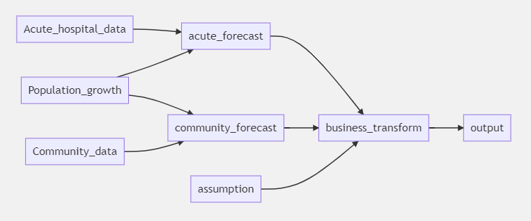

# Healthcare system modelling using Python, Pandas and Dask

Activity and finance modelling is a task frequently undertaken using spreadsheets and, for simple models, this works well. However, as models become more complex developing and maintaining models in spreadsheets becomes harder - particularly when the models have more than two dimensions such as age, sex, disease group, hospital, region, year, and so on. For larger models alternative approaches are required, in this case the proposed approach uses [Python](https://www.python.org/), [Pandas](https://pandas.pydata.org/) and [Dask](https://dask.org/). The benefits of this approach are:

+ **Separation of code, data and presentation** - Separating the modelling into the three domains provides greater flexibility in the development of the model and makes extending the model to additional dimensions or changing data easier.

+ **Version control** - There are better version control tools available to Python developers which don't exist for spreadsheets.  

+ **Documentation** - Coding in Python has a strong culture of documentation which increases code maintainability if used appropriately.

+ **Unit testing** - Separation of the code from the data provides greater opportunities to introducing unit testing.

Models developed using spreadsheets still have some advantages. The models are typically packaged in a single file and use commonly available software which makes distribution of models easier; and, there is a large pool of expertise working to best practice familiar with implementing models in spreadsheets. The approach set out in this intended as a starting point for developing best practice modelling using Python, Pandas and Dask.

This example project provides an implementation of a simple forecasting model using Dask and Pandas DataFrames. The model is greatly simplified for demonstration purposes, however, covers the main principles of importing data, performing calculations and outputting the results.

## The modelling paradigm

Developing activity and financial models requires an approach which are easily communicated to decision makers. Decision makers who are actively involved in the development of models are more likely to trust the model's outputs. Easily communicated models are high level and focus on how the input data is transformed by the model's structure to produce the output.

Spreadsheets use a functional programming approach which transforms data until the required output is achieved. Models implemented in spreadsheets are directed acyclic graphs of functions which are calculated when a result is required. The graph becomes visible when worksheet auditing tools are used to reveal precedent and dependent cells. The weakness of spreadsheets is they don't fully use the concept of arrays, therefore, each individual cell is independent of any other cell and formula are specified for each cell in a table rather than a single formula applied across all cells. This significantly complicates the execution graph and makes reading and maintaining models implemented in spreadsheets more difficult.

The modelling approach adopted within this example uses Pandas to implement arrays of data within the model (to support high dimension models) and Dask to support the creation and execution of the model implemented as a directed acyclic graph of functions. This retains the functional programming approach of modelling in spreadsheets with the advantage that functions apply to arrays of data rather than individual cells.

## Case study example - healthcare system reconfiguration

The case study is loosely based upon a real world example in which providers in the healthcare system plan to move activity from acute hospitals into the community. The assumption is that 20% of acute hospital activity can be moved to the community, though this varies by service line. The system has three hospitals (Hospital One, Two and Three) serving four regions (North, South, East, West) and each hospital provides one of six services (Cardiology, Dermatology, Diabetes, Respiratory, Rheumatology, Urology). The forecasting period starts in year 2021 with changes implemented on the 1 January 2025. Activity from the base year (2020) is available for acute hospital and community split by hospital, region, service line, patient age and sex. Activity growth is forecast to increase in line with demographic change (age, sex).

The model structure is shown in the following diagram:



Historic data for the base year (2020) is contained within two files (acute_hospital_data, community_data) each file provides activity for each hospital, region, service line, sex and five-year age band. This activity is forecast forward using population_growth data (year, sex, age band) to produce an acute_forecast and community_forecast. The assumption for the amount of activity that can be transferred to the community is read from the assumptions file and used to produce a post transformation forecast (business_transform).

Example output from the case study example is included in `Healthcare system model.ipynb`

## Code examples

The dependencies for this project are managed using Poetry and pyproject.toml. To install dependencies:

Install Poetry `pip install poetry`

install dependencies `poetry install`

The `requirements.txt` for pip and `environment.yml` for conda files were auto-generated but have not been tested.


The approach to modelling is founded on the following principles:

+ All input data and assumption are kept external to the model either in files such as (CSV, YAML) or databases. In this example data is stored in the Import_data folder as CSV files.

+ The unit of data is a Pandas DataFrame. All data within the model is held and processed using Pandas.

+ Units of data are encapsulated within a class. The class has an attribute `data` which provides access to the data. The data is a [Dask Delayed](https://docs.dask.org/en/latest/delayed.html) object.

+ Input data and assumptions are loaded into classes which expose that data as a `Dask Delayed` object on the `data` attribute.

+ Functions which transform data are implemented as `Dask Delayed` functions within a class. These accept `Dask Delayed Pandas dataFrames` as inputs and expose the result on the `data` attribute as a `Dask Delayed` object. See example code below.

+ Once all the data input and functions classes are defined them graph can be executed using the `.compute()` method on the output `data` attribute. This executes the graph and returns the output of the final function.

+ A visualisation of the model is available using the `.visualize()` method on the output `data` attribute. Note: this requires both the GraphViz Python library and the GraphViz system library, see [Dask - Visualise Task Graphs](https://docs.dask.org/en/latest/graphviz.html).

### Create functions on the execution graph

Dask delayed function are implemented in the code as shown in the example below.

+ The implementation of the function is implemented within a base class as an imperative method. Implementing the code in a class allows that class to be inherited into multiple other classes which define the execution graph and support the DRY (Don't Repeat Yourself) principle. Implementing the method as an
imperative function facilitates the creation of automatic tests (note that applying the `@delayed` decorator to these functions would make testing more complex).
An example can be seen in the data import where a loader is defined as the base class and inherited by multiple implementations to load each individual input data file. The base class in the code snippet below is forecast\_base and the private method implementing the function is \_forecast\_calculation.

+ Functions are added to the execution graph by inheriting the base class into the implementing class and wrapping it with dask `delayed` function to convert
it into a delayed function.

+ The parameters of the function are the outputs of previous delayed functions. This creates the links in the execution graph.

+ The output of the function is exposed on the data attribute of the class. This is consumed by later nodes by creating an implementation of the class e.g. acute_forecast().

+ The name of the node in the execution graph visualisation is the name of the underlying implementing method in the base class. When the base class is inherited by multiple implementing classes then the same name will appear for multiple nodes. The name of the implementing node can be specified by adding dask\_key\_name as parameter. Note: The name must be unique across all Dask nodes in the execution graph, and must not match a Python object name (class or method name).

```python
# Implementation of the function applied to the inputs
class forecast_base:
    def _forecast_calculation(
        self,
        historic_activity: pd.DataFrame,
        population_growth: pd.DataFrame
    ) -> pd.DataFrame:

    # Code implementing the function

    return df

# Class exposing the results of the function on the data attribute
class acute_forecast(forecast_base):
    @property
    def data(self) -> Delayed:
        return delayed(self._forecast_calculation)(
            historic_activity=acute_data().data,
            population_growth=population_data().data,
            # Prefix dask key name with fa_ to avoid clashing with name of this class
            dask_key_name = "fa_acute_forecast"
        )
```

### Compute the execution graph

To execute the model create an instance of the output node class and run the compute method on the data attribute.

```python
output = business_transform().data.compute()
```

### Visualise the execution graph

To visualise the graph create an instance of the output node class and run the visualize method on the data attribute.

```python
png = business_transform().data.visualize()
```
